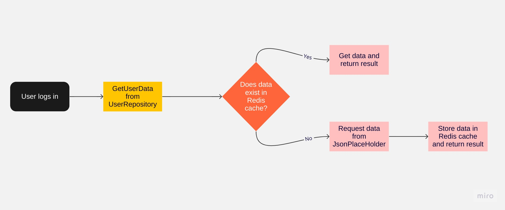

# Innoloft-Backend
 
## Description

This project is a web application built from scratch using __ASP.NET Core 6.0__. It took around __8 hours__ to develop the core functionalities. The application includes event management, user authentication, and participants invitation.

## Project Structure

This is a .NET Core application project structured in a clean and organized way, following the SOLID principles and Dependency Injection design pattern.

### Structure Explanation

- **Innoloft.Cache.Redis**: This project provides an implementation of Redis caching in the application.
- **Innoloft.Domain**: This project contains the application's domain entities, extension methods, and repositories.
- **Innoloft.EntityFramework**: This project utilizes Entity Framework for data storage.
- **Innoloft.Shared**: This project includes DTOs, enums, and other shared resources used throughout the application.
- **Innoloft.Tests**: This project contains unit tests for the application.
- **Innoloft.Web**: This project contains the API endpoints and controllers for the application. It also includes a structured exception handling middleware and a structured response action filter to handle exceptions and format API responses in a consistent manner.

This project structure is modular, scalable, and testable. It follows the best coding practices and encourages code reusability.

## File Structure

The project file structure is organized as follows:

```plaintext
|-- Innoloft.Cache.Redis
|-- Innoloft.Domain
|   |-- Entities
|   |-- Extension Methods
|   |-- Repositories
|-- Innoloft.EntityFramework
|-- Innoloft.Shared
|   |-- DTOs
|   |-- Enums
|-- Innoloft.Tests
|-- Innoloft.Web
|   |-- Controllers
|   |-- Helpers
|   |   |-- Exception Handling Middleware
|   |   |-- Response Action Filter
```

### Features and Technologies

- __Entity Framework Core__ as ORM for database management
- __JSONPlaceholder API client__ for fetching user data
- __Redis cache__ for user data storage
- API endpoints for authentication, event management, and event invitations
- Global exception handler for better error handling
- __Unit test__

### Entities and Repositories

- Events
- Event Participants

### User Repository and User Login Flow

A user repository has been created with a specific function that follows a two-step approach to fetch user data:

1. The function first attempts to retrieve user data from the __redis cache__.
2. If the data is not found in the cache, it then fetches the data from the __JSONPlaceholder client__.

Once the required data is obtained, it is cached in Redis for future use.

The application utilizes JSONPlaceholder as a source of user data, and it is important to note that there are only 10 available users (with user IDs between 1 and 10). The user flow is as follows:

1. A user logs in using the login endpoint by sending their user ID (allowed IDs are between 1 and 10).
2. The login function attempts to get the user data from the user repository.
3. Upon successful retrieval of user data, a Bearer token is generated for the user.
4. Some user data like user Id is saved within the token to be utilized later in the application.

Below is a simple visual representation of the login flow for a better understanding:



### API Endpoints

#### Authentication

- User login

#### Event Management

- Get all events with __pagination__ and various filters
- Get __event details__ by event Id (gets event, participants, and users info)
- Get event by ID
- Add and update events (CreatorUserId is stored by being fetched from token)
- Delete events (only for events without participants)

#### Event Invitations and Participants

- Get received invitations
- Get sent invitations
- Invite a user to an event (only event creator can do this)
- Register to an event
- Approve or decline invitations
- Cancel event registration

### Tests

- Unit test in `Innoloft.Tests` project for event creation

## Setup and Running


Clone the repository
```sh
git clone https://github.com/uka7/Innoloft-Backend.git
```

Navigate to the project directory
```sh
cd Innoloft-Backend
```
### Local Setup

1. Run MariaDB and Redis using Docker:

```sh
docker run -d --name mariadb --network=host -e MYSQL_ROOT_PASSWORD=root mariadb:10
```

```sh
docker run -d --name my-redis -p 6379:6379 -d redis
```

2. Update the connection string in `appsettings.json` and Redis connection details based on the above information.

3. Run the `Innoloft.Web` project.

### Docker Setup

1. Navigate to the project root directory and run:

```sh
docker-compose up --build
```

2. Wait for all services to start.

3. Access the Swagger UI at `http://localhost:5000/swagger/index.html`.